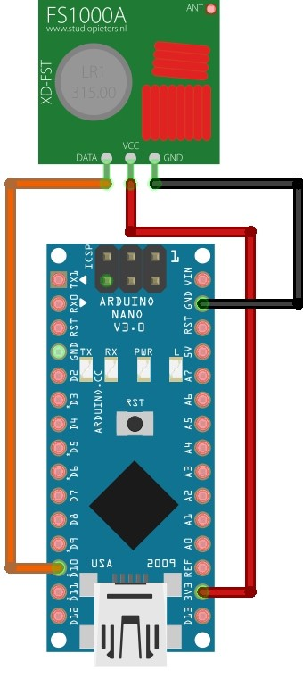

# Arduino-garage-door-opener
### How to copy a garage keyfob and send it with an Arduino

  Garage door openers primary operate on 433 MHz frequency band. The technology of these fobs is very basic and crude, and have no security or encryption in place. This makes it relatively easy to copy the ASK modulated signal and re-transmit it. This is the code that allows you to do that very easily and cheap!

### Schematic

  

For more info: www.behindthesciences.com

